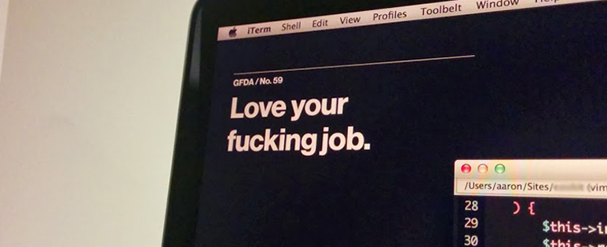

I can't see myself going back into full-time employment. Ever.

### Previously.

I ended my [last post](/blog/freelance-the-catch-up) with two things on the agenda:

> 1. Going to see an accountant for some advice on my next steps (and to check
that what I've done so far was actually a good idea). I'm hoping they'll shed some
light on the letters I recieved this morning.
>
> 2. Going to the bank to set up a business bank account. At the moment I'm being paid into
one of my personal accounts, which is probably bad (since the business is a seperate entity).

#### 1. The Accountants.

I just took everything to the accountants and [acted the fool](http://youtu.be/TA7gnSyuIik).
As it turns out, I don't have to do anything yet!

There is a 3 month 'settling in period' with limited companies, so I've been advised to
simply see what happens over the next month. The kind of clients I deal with, and the
kind of money I'm making will decide how we continue.

##### 1.5 FreeAgent

I've been using [FreeAgent](http://freeagent.com/) to keep track of my contacts,
draft and send estimates, invoice, track time and money. It's great. Really great.

The first accountant I visited had never heard of it. The second accountant had
and recognized it would make both our lives easier, and thus, charges me 50% less
than the first accounant would have.

Sweet.

#### 2. The Bank.

I've banked with [Barclays](http://barclays.co.uk/) (personally) forever, so, it
made sense to open a business account with them too.

It's straight forward, just phone a local branch, book an appointment, take in
your certificate of incorporation, proof of who you are and that you have
shares in the company. It takes around 30 mins.

It turns out it was fine to be paid into my personal account temporarily while
the business account was being openened.
I simply transfered the money to the business account once it opened a few days later.

##### 2.5 FreeAgent, again.

You have to explain your business transaction to HMRC. FreeAgent makes this a
cinch with Bank Feeds.

Every day FreeAgent automatically reads my transactions from
the bank and marks them for explination (and in most cases, makes very good
automatic guesses for things like invoices or expenses being paid).

Barclays not only have Bank Feeds, but they bolted on
[MyBusinessWorks](https://www.mybusinessworks.co.uk) (which includes FreeAgent),
for a cheaper than the cost of FreeAgent.

Sweet.

### Money.

I'll be taking money out of the business through a small salary, and dividends.
The reason you take both is, I believe, to take advantage of the allowance you
get of non-taxable income from a salary. The rest you take in dividends.

I've not got my salary set up yet, so for now it's just dividends.

#### Dividend.

> A dividend is a payment made by a corporation to its shareholders, usually as a distribution of profits.
> <cite>[Wikipedia](http://en.wikipedia.org/wiki/Dividend)</cite>

There is, legally, some paperwork <del>you have to do</del> FreeAgent automatically
does for you when taking a dividend.

The tax payable on a dividend is simply 1/9th of the amount, as you can see here:

Happy days.

#####  Disclaimer.

I am **not** an accountant. I'm writing this as a developer. I have absolutely
no idea what I'm doing. I'm just doing the developer thing and picking it up as
I go along. I'm destined to **fuck something up** (and then blog about it).
Take everything with a pinch of salt.
