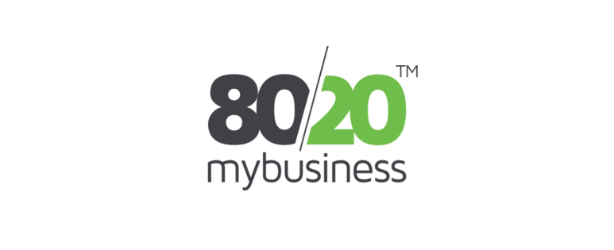

import { Image } from 'astro:assets';
import Browser from '../../components/Browser.astro';
import analysis from '../../images/blog/project-8020mybusiness/analysis.jpg';
import plans from '../../images/blog/project-8020mybusiness/plans.png';

It's been well over a year since I've written about a project - let's change that.



The pareto principle (aka the 80/20 rule) is crazy. It states that roughly 80% of
effects come from 20% of the causes.

Vifredo Pareto (whom the principle is named after) first noted the 80/20 connection by
showing that approximately 80% of the land in Italy was owned by 20% of the population, and
about 20% of peapods contain 80% of the peas.

From then, folk have noticed the pareto principle popping up all over the place:

- 20% of the carpet in your home sees 80% of the use.
- 20% of the quintile population earns 80% of the income.
- 20% of a codebase harbours 80% of the errors
- 80% of a company's revenue come from 20% of its customers
- 80% of a company's complaints come from 20% of its customers
- 80% of a company's sales are made by 20% of its staff
- and so on...

## What is it?

80/20 MyBusiness is an online statistical analysis tool, based on the pareto principle. The goal is to
provide evidence and advice aimed towards improving business performance.

All the user has to do is upload a spreadsheet of sales data and kick back while the algorithm crunches the numbers.

### Analysis

After running analysis on sales data, the user is presented with results in three different ways: a pareto, as quadrants and as a table.

<Browser url="https://8020mybusiness.com/">
    <video preload="none" loop muted disablepictureinpicture class="m-0">
        <source type="video/webm" src="/videos/projects/8020mybusiness/analysis.webm" />
        <source type="video/mp4" src="/videos/projects/8020mybusiness/analysis.mp4" />
        <Image src={analysis} alt="80/20 MyBusiness - Analysis" />
    </video>
</Browser>

It's hard to go into a lot of detail on what 80/20 MyBusiness can actually show, because it completely depends on what data the user uploads.

That being said, here are some examples of what kind of business decisions the results can guide the user into making:

- Which products are least profitable and should be culled
- Which customers are most profitable and should be kept
- Who is the most profitable employee (or department)
- and so on...

Paying users can dive deeper into analysis with the ability to add variable margins, expenses and overheads.
This enables them to see more accurate and relevant results from their sales data.

### Processing

Users spreadsheets can be quite large, and would certainly cause long delays and/or timeout problems if analysis was done synchronously. So, analysis is run in the
background - while the user is either watching the video, or has left the site to do something else (we email them when it's done).

The algorithm for processing each analysis is is quite long and complex, but early on I noticed that each analysis (initial, variable margins, expenses
and overheads) shared a common set of "tasks", the main differences being: a change in the order of the tasks or addition/removal of tasks.

Based on this, I developed a system where the analyses are essentially boiled down to become instructions - each task works as a standalone process and
is simply called when instructed. For example:

```
Analysis        | Tasks
--------------------------------
Initial         | A, B, C
Variable margin | A, D, B, C
Expense         | A, E, C, B
Overheads       | A, E, D, C, B
```

### Subscription

<Browser url="https://8020mybusiness.com/costs">
    <Image src={plans} alt="80/20 MyBusiness - Plans" />
</Browser>

Users can upgrade/downgrade any time on a monthly rolling basis - however, they will lose access to the deeper analysis they've run when downgrading.

## Final words

I worked closely with LYD through prototyping, testing, building and eventually roll out to create this first version of the product.

80/20 MyBusiness have plans to keep expanding functionality throughout 2017 and beyond.

I'm looking forward to seeing where the product goes, and will hopefully be along for the ride.
